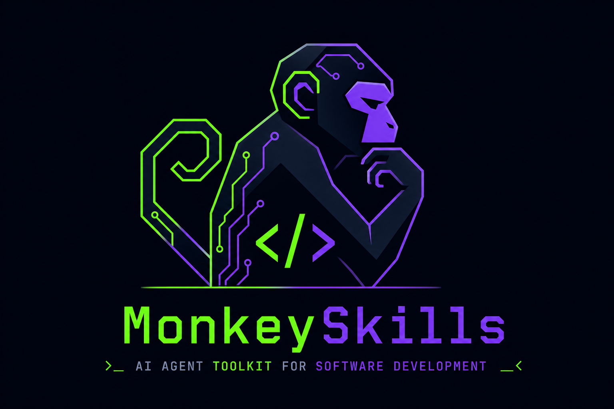

<div align="center">
  

  <br />

  **AI-driven development lifecycle skills for Claude Code & Cursor**

  [](LICENSE)
  [](https://nodejs.org)
  [](https://claude.ai/code)
  [](https://cursor.sh)

</div>

---

MonkeySkills is an open-source suite of structured AI agent skills that guide your entire product development lifecycle — from raw idea to shipped feature — using a pipeline of specialized skills that hand off to each other.

```
@monkeythink  →  @monkeyplan  →  @monkeymode  →  @commit
  Explore          Plan            Build           Ship
```

Each skill is a set of markdown files that tell your AI agent exactly what to do, in what order, and how to track state across sessions. No lock-in, no proprietary tooling — just structured prompts that work in Claude Code, Cursor, and any AI IDE.

---

## The Pipeline

```
┌─────────────────────────────────────────────────────────────────────┐
│                       MonkeySkills Pipeline                         │
├──────────────┬──────────────┬──────────────────┬────────────────────┤
│ @monkeythink │ @monkeyplan  │   @monkeymode    │     @commit        │
│              │              │                  │                    │
│ Phase 0      │ Phase 0      │ Phase 1          │                    │
│ Problem      │ Intake       │ Design           │  topic branch      │
│ Framing      │              │                  │  per-story commits │
│              │ Phase 1      │ Phase 2          │  PR generation     │
│ Phase 1      │ Requirements │ User Stories     │                    │
│ LLM Council  │              │ + Acceptance     │                    │
│ Exploration  │ Phase 2      │ Checklist        │                    │
│              │ UX Ideation  │                  │                    │
│ Phase 1b     │              │ Phase 3          │                    │
│ Synthesis    │ Phase 3      │ Code Specs       │                    │
│              │ Epic         │                  │                    │
│ Phase 2a     │ Breakdown    │ Phase 4          │                    │
│ Direction    │              │ Implementation   │                    │
│ Setting      │   handoff ──►│ (TDD, parallel)  │                    │
│              │              │                  │                    │
│ Phase 2b     │              │ Phase 5          │                    │
│ UI Concept   │              │ Verification     │                    │
│              │              │                  │                    │
│ Phase 2c     │              │ Phase 6          │                    │
│ Risk         │              │ Integration      │                    │
│ Challenge    │              │                  │                    │
│              │              │ Phase 7          │                    │
│ Phase 3      │              │ Acceptance       │                    │
│ Discovery    │              │ Testing          │                    │
│ Brief ──────►│              │                  │◄── invoke anytime  │
└──────────────┴──────────────┴──────────────────┴────────────────────┘
```

---

## Skills

### 🔍 @monkeythink — Explore

*"What problem are we actually solving?"*

Takes a raw idea and runs it through a structured discovery process before any requirements are written.

```
Phase 0   Problem Framing      Guided interview — problem, affected parties, opportunity, constraints
Phase 1   LLM Council          3 AI agents explore the solution space independently
Phase 1b  Synthesis Review     Orchestrator merges council responses; surfaces consensus & contradictions
Phase 2a  Direction Setting    User picks a direction; scope, success criteria, constraints defined
Phase 2b  UI Concept           Generates a live .canvas.tsx + ui-concept.html from your brand tokens
Phase 2c  Risk Challenge       Council red-teams the chosen direction
Phase 3   Discovery Brief      Structured handoff artifact → @monkeyplan
```

**LLM Council modes:**

| Mode | How it works | When to use |
|------|-------------|-------------|
| **Parallel** | 3 subagents (Claude, GPT, Gemini) run simultaneously | Cursor with Task tool |
| **Sequential** | Same LLM reasons from 3 different persona biases | Any AI IDE |
| **Manual** | Exports 3 prompt files for you to run in separate tabs | Maximum model diversity |

---

### 📋 @monkeyplan — Plan

*"What exactly are we building and why?"*

Transforms a discovery brief into structured product requirements and Jira/Linear-ready epics.

```
Phase 0   Intake            Load discovery brief or interview the user
Phase 1   Requirements      Full PRT — problem, personas, user flows, acceptance criteria
Phase 2   UX Ideation       Wireframe sketches and UX specs
Phase 3   Epic Breakdown    Jira/Linear/GitHub-ready epics and stories + optional tracker upload
```

**Tracker upload:** After epic breakdown, prompts to upload directly via MCP connection (Jira, Linear, GitHub Projects) or export as markdown.

---

### 🏗️ @monkeymode — Build

*"Build it correctly, the first time."*

Full self-driving development lifecycle with TDD, parallel subagents, and acceptance testing.

```
Phase 1   Design             Architecture, API contracts, data models, operations
Phase 2   User Stories       Parallelizable stories decomposed from design
Phase 2B  Acceptance         Drafts the manual + automatable acceptance checklist
Phase 3   Code Spec          Atomic implementation plan + test case tables per story
Phase 4   Implementation     test-writer → implementer pipeline (up to 10 parallel subagents)
Phase 5   Verification       verifier subagents check every story; rework loop (max 3 attempts)
Phase 6   Integration        Shared files merged, cross-story wiring, e2e tests
Phase 7   Acceptance         Runs the Phase 2B checklist; agent-automatable + human-verified items
```

**Phase 4 TDD pipeline:**

```
For each batch of stories (up to 10 parallel):
  ┌─────────────────────────────────────────────────────┐
  │  Step 1: test-writer subagents                       │
  │  Write red tests from code spec (read spec only,     │
  │  never touch production code)                        │
  │                     ↓                               │
  │  Confirm all tests FAIL (red state enforced)         │
  │                     ↓                               │
  │  Step 2: implementer subagents                       │
  │  Make tests pass (read tests, write production code) │
  │  Narrow escape hatch: may flag incorrect test cases  │
  │  but logs every correction — never silently changes  │
  └─────────────────────────────────────────────────────┘
```

**Language guidelines included:**

| Language | Guideline |
|----------|-----------|
| Python | Enterprise PEP 8, type hints, pytest |
| Java | Google Java Style, JUnit 5, Spring DI |
| React / TypeScript | Server Components, React Compiler, Vitest |
| Angular | Signals, strict mode, standalone components |
| .NET / C# | Nullable types, async/await, xUnit, EF Core |
| Terraform | HCL style, modules, state management |

---

### 🔀 @commit — Ship

*"Clean git history, every time."*

Context-aware git workflow that reads MonkeyMode state to generate intelligent commits.

```
Phase-aware commits    Maps changed files → MonkeyMode phase → correct commit message prefix
Conflict detection     Reads story file lists to split multi-story commits correctly
Branch safety          Always creates feat/ or bugs/ topic branches; never commits on main
Auto-push              Pushes topic branch and surfaces PR link after every commit
PR generation          Generates PR body from MonkeyMode artifacts on request
```

---

## Install

```bash
npx github:human-plus-machine/monkeyskills
```

**Options:**

```bash
npx github:human-plus-machine/monkeyskills --dry-run    # preview without writing
npx github:human-plus-machine/monkeyskills --both       # Claude + Cursor (non-interactive default)
npx github:human-plus-machine/monkeyskills --claude-only
npx github:human-plus-machine/monkeyskills --cursor-only
```

On a TTY, the installer asks **1** Claude only, **2** Cursor only, or **3** both (default). Existing skills and subagents under the chosen location(s) are **replaced** each run. In CI or piped input, use the flags above or set `MONKEYSKILLS_TARGETS` to `claude`, `cursor`, or `both`. For Cursor, Task subagent markdown goes to **`~/.cursor/agents/`** (where Settings lists them); Claude Code uses **`~/.claude/subagents/`**.

Restart Claude Code or Cursor after installing. Skills appear in the `/` command list.

**Requirements:** Node.js 18+ · Claude Code or Cursor

---

## How State Works

Every skill creates a hidden state folder in your workspace:

```
{your-project}/
├── .monkeythink/{topic}/
│   ├── state.json              ← phase tracker, preferences, council mode
│   ├── framing.md
│   ├── council-responses/      ← raw LLM council outputs
│   └── discovery-brief.md      ← handoff to @monkeyplan
│
├── .monkeyplan/{feature}/
│   ├── state.json
│   └── prt.md                  ← full requirements doc
│
└── .monkeymode/{feature}/
    ├── state.json              ← per-story status, verification results, rework history
    ├── design/
    ├── stories/
    │   ├── user_stories.md
    │   └── 2b-acceptance.md    ← acceptance checklist
    └── code_specs/
```

State is plain JSON. You can inspect it, edit it, or reset a phase by changing `current_phase`. Sessions resume automatically — invoke the skill in any session and it picks up where it left off.

---

## Subagents

MonkeyMode uses specialized subagents for parallelism and role separation:

| Subagent | Role | Phase |
|----------|------|-------|
| `test-writer` | Writes red tests from code spec only | Phase 4 Step 1 |
| `implementer` | Makes tests pass; never modifies tests silently | Phase 4 Step 2 |
| `verifier` | Read-only checklist verification against spec | Phase 5 |
| `reworker` | Fixes implementation issues from verifier report | Phase 5 rework loop |
| `council-claude` | Analytical reasoning bias | Phase 1 / 2c |
| `council-gpt` | Pragmatic, outcome-oriented bias | Phase 1 / 2c |
| `council-gemini` | Expansive, creative bias | Phase 1 / 2c |

---

## Design System Integration

MonkeyThink's UI Concept phase (Phase 2b) uses [Google's DESIGN.md](https://stitch.withgoogle.com/docs/design-md/overview/) specification for brand-aware prototyping:

```bash
# Auto-generated or loaded from your workspace root
DESIGN.md   ← colors, typography, spacing, border radius, component tokens

# Linted before use
npx @google/design.md lint DESIGN.md

# Applied to both outputs
ui-concept.canvas.tsx   ← live preview in Cursor canvas panel
ui-concept.html         ← self-contained, opens in any browser
```

---

## License

MIT — use it, fork it, build on it.

---

<div align="center">
  <sub>Built for developers who want AI that works <em>with</em> a process, not around one.</sub>
</div>
