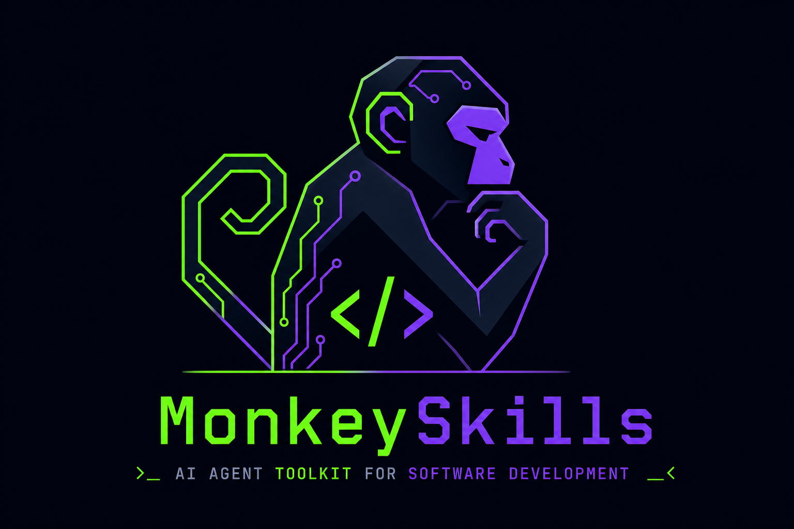

# MonkeySkills

<div align="center">
  

  <br />

  *AI-driven development lifecycle skills for Claude Code & Cursor*

  [](LICENSE)

</div>

MonkeySkills is an open-source set of structured agent skills that take a product from raw idea to shipped feature. Each skill is markdown your agent follows, with resumable workspace state and handoffs between skills—no proprietary lock-in, and it works in Claude Code, Cursor, and similar IDEs.

> [!NOTE]
> Each install run **replaces** existing MonkeySkills files under the target locations you select (Claude, Cursor, or both).

## Installation

```bash
npx github:human-plus-machine/monkeyskills
```

On a TTY, the installer prompts for Claude only, Cursor only, or both (default). For CI or piped input, use `--both`, `--claude-only`, or `--cursor-only`, or set `MONKEYSKILLS_TARGETS` to `claude`, `cursor`, or `both`. Use `--dry-run` to preview without writing files. Cursor Task subagents are written to `~/.cursor/agents/`; Claude Code uses `~/.claude/agents/`. Restart Claude Code or Cursor after installing. Skills show up in the `/` command list.

## Requirements

Node.js 18+ · Claude Code or Cursor

## Available Skills

- [**@monkeythink**](monkeythink/SKILL.md) — Problem framing, LLM council exploration, direction and risk review, optional UI concept from brand tokens, and a discovery brief for planning.
- [**@monkeyplan**](monkeyplan/SKILL.md) — Intake, full product requirements, UX ideation, and epic/story breakdown (including optional tracker upload).
- [**@monkeymode**](monkeymode/SKILL.md) — Design through acceptance: user stories, code specs, TDD-style implementation with parallel subagents, verification, integration, and acceptance testing.
- [**@monkeycleaner**](monkeycleaner/SKILL.md) — Anti-slop review for code, designs, plans, and PRs: complexity, scalability/state, and observability gaps.
- [**@architect**](architect/SKILL.md) — Design and seed MonkeyApp topologies: Main Agent, specialists, workspaces, routines, skills, and MCP connectors (branch harness or live home).
- [**@commit**](commit-skill/SKILL.md) — Topic branches, phase-aware commits, optional PR body from MonkeyMode artifacts.

Build pipeline extras:

- [**@monkeytriage**](monkeytriage/SKILL.md) — Triage entry point: scores a feature's complexity and routes to `@monkeymode-lite` or `@monkeymode`.
- [**@monkeymode-lite**](monkeymode-lite/SKILL.md) — Condensed four-phase workflow (design, code spec, implementation, verification) for small, single-story features. Requires `@monkeymode` installed alongside for its guides.
- [**@design-context**](design-context/SKILL.md) — Maps a requirement onto tech, platform, and cloud axes and emits a `design-context.md` that other skills read if present.
- [**@explore**](explore/SKILL.md) — Engineering spikes and throwaway POCs: iterate, lock a direction, capture technical design, hand off to planning or build.
- [**@scope**](scope/SKILL.md) — Technical blueprint between requirements and design: system design, effort, dependencies, edge cases, per-team scopes, and sign-off.
- [**@prototype**](prototype/SKILL.md) — Turn an idea or a production URL into side-by-side standalone HTML prototypes, one per design direction.
- [**@story-spec**](story-spec/SKILL.md) — One engineering-ready story: scope, dependencies, sizing, acceptance criteria, regression checklist, and optional tracker sync.
- [**@engineering-hld**](engineering-hld/SKILL.md) — Contract-first high-level design: lock the API, let a council pick a candidate, earn each extra component.

Review and quality:

- [**@pr-review**](pr-review/SKILL.md) — Review a pull request for architecture alignment, security, and repo conventions; draft findings and post on approval.
- [**@pr-merge**](pr-merge/SKILL.md) — Review, gate on hard stops, then approve and merge a pull request with per-step confirmation.
- [**@perf-review**](perf-review/SKILL.md) — Find runtime bottlenecks in a file, diff, or module: N+1 queries, quadratic loops, leaks, missing pagination.
- [**@qa-automation**](qa-automation/SKILL.md) — Plan, write, and run UI and API test automation against a running app.
- [**@code-simplifier**](code-simplifier/SKILL.md) — Refine code for simplicity and readability without changing behavior.

Utilities:

- [**@document-codebase**](document-codebase/SKILL.md) — Generate architecture, structure, API, and dependency docs for an existing codebase.
- [**@markitdown**](markitdown/SKILL.md) — Convert PDF, Office, image, audio, and HTML files into LLM-ready Markdown.
- [**@agent-authoring**](agent-authoring/SKILL.md) — Author agent-facing docs so the process is predictable.

**Pipeline:** `@monkeythink` → `@monkeyplan` → `@monkeymode` (or `@monkeytriage` to pick a tier) → `@monkeycleaner` → `@commit`

## State and subagents

Skills persist plain JSON and markdown under `.monkeythink/`, `.monkeyplan/`, and `.monkeymode/` in your project so you can resume or adjust phases between sessions. Full phase flow, TDD pipeline, and verification behavior are described in [monkeymode/SKILL.md](monkeymode/SKILL.md). Role-specific prompts for councils and build-time parallelism live under [`subagents/`](subagents/).

MonkeyThink’s UI Concept phase can use [Google’s DESIGN.md](https://stitch.withgoogle.com/docs/design-md/overview/) for tokens; workflow detail is in [monkeythink/phases/02b-ui-concept.md](monkeythink/phases/02b-ui-concept.md).

## Support

If you need help or hit a problem with these skills, search existing issues or open a new one in the [GitHub issue tracker](https://github.com/human-plus-machine/monkeyskills/issues).

## Contributing

Contributions are welcome. You can help by:

- Reporting bugs or inaccuracies in the skill markdown (via issues).
- Suggesting new skills, phases, or integrations (feature requests welcome).
- Opening pull requests for fixes and improvements.

## License

You may use, modify, and distribute MonkeySkills under the MIT license. See the [`LICENSE`](LICENSE) file for details.
