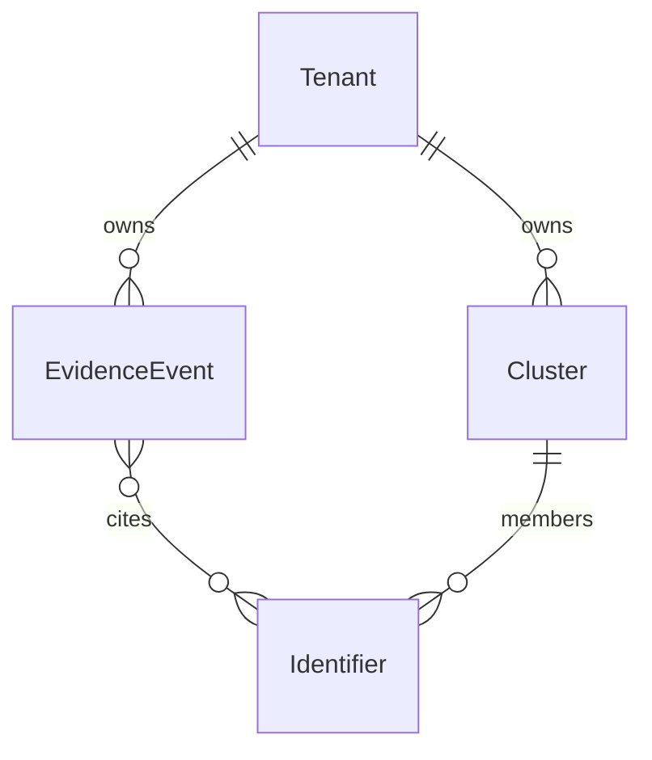
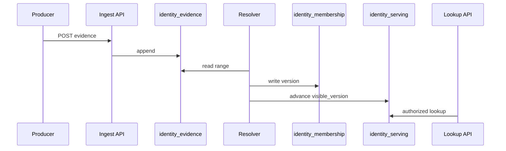
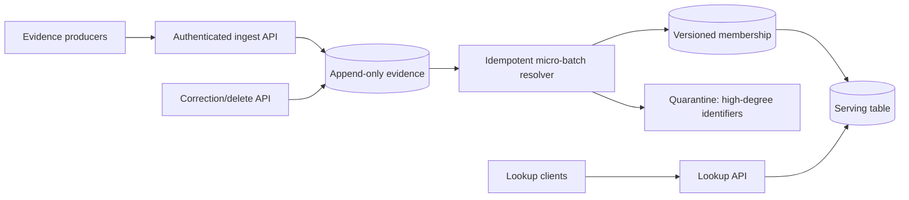

# Greenfield Full HLD example: Identity Resolution

**Kind:** Greenfield Full HLD. Shape only. Copy no numbers. Every value is **Assumption**.

# Engineering HLD: Tenant-Scoped Identity Resolution

**Mode:** Full HLD  
**Grounding:** Draft  
**Decision status:** Decided for prototype validation  
**Scope:** Ingest identifiers, resolve tenant-scoped person clusters, and serve
lookup; excludes cross-tenant matching and probabilistic ML.

## Decision

Use an append-only evidence table plus a relational membership table, compute
deterministic connected components in idempotent micro-batches, and publish a
versioned serving table. Do not introduce a graph database or streaming engine:
the assumed freshness and component sizes do not earn them.

## Evidence ledger

| Input | Value | Class | Source |
|---|---:|---|---|
| Daily evidence | 86.4M events/day | Assumption | Worked example |
| Peak ingress | 4,000 events/s | Assumption | Worked example |
| Stored event | 500 B | Assumption | Worked example |
| Retention | 90 days | Assumption | Worked example |
| Lookup peak | 2,000 requests/s | Assumption | Worked example |
| Lookup p99 | ≤100 ms | Assumption | Worked example |
| Resolution freshness | ≤5 min | Assumption | Worked example |
| Consistency | Read-your-writes not required; version-consistent result required | Assumption | Worked example |
| Largest component | ≤100 members after quarantine | Assumption | Worked example |

## Functional requirements

- A tenant should be able to ingest identifier evidence.
- A tenant should be able to look up the cluster for an identifier.
- A tenant should be able to submit correction or delete evidence.

## Non-functional requirements

- The system should complete lookup at p99 ≤100 ms.
- The system should publish a new complete cluster version within 5 minutes of ingest.
- The system should isolate tenants: no identifier links across tenants.
- The system should expose one complete cluster version to readers, never partial membership.
- A retried evidence event should change membership at most once.

## Core entities



| Entity | Identity | Invariants | Relationships | Lifecycle |
|---|---|---|---|---|
| Tenant | `tenant_id` | Never observes another tenant | Owns evidence and clusters | Long-lived |
| EvidenceEvent | `(tenant_id, event_id)` | Append-only; duplicate is no-op | Belongs to tenant; cites identifiers | Retained 90 days (assumed) |
| Identifier | `(tenant_id, namespace, value)` | Namespace-scoped equality | Edges to other identifiers via evidence | Mutable via correction |
| Cluster | `(tenant_id, cluster_id, version)` | Readers see one complete version | Membership of identifiers | Versioned; prior version remains visible |

## APIs

| API | Method / event | Request | Response | Idempotency | AuthZ | Failure |
|---|---|---|---|---|---|---|
| Ingest | `POST /tenants/{tenant_id}/evidence` | event_id, identifiers | acceptance | event_id | tenant resource | Duplicate returns prior acceptance |
| Lookup | `GET /tenants/{tenant_id}/identities/{namespace}/{value}` | path keys | cluster_id + version | read | tenant resource | 404 if absent; no cross-tenant fallback |
| Correct | compensating evidence event | same as ingest | pending until published | event_id | tenant resource | Lag until publish; measured |

## Data flow



1. Ingest validates tenant, namespace, event identity, and schema, then appends.
2. Resolver reads the next range, builds exact-key edges, quarantines high-degree identifiers, writes a membership version.
3. Publication atomically advances the tenant’s visible version.
4. Lookup authorizes tenant access and reads only the visible version.
5. Correction appends compensating evidence; resolver rebuilds affected membership.

## Council

Shape only. Copy no member prose.

| Candidate | Member | Extra boxes | Verdict |
|---|---|---|---|
| Append-only evidence + membership + versioned serving | simple, operate | none required | **Winner** — meets ingest/lookup/correct with fewest extras |
| Same stores + streaming processor | isolate | stream processor | Loser — extra box; freshness met by micro-batch |
| Graph database of identifiers | isolate | graph store | Loser — extra box; no online traversal FR |

**Winner:** append-only evidence + relational membership + versioned serving,
because it meets every FR with the fewest extra boxes. Graph DB and streaming
are extras; Earn still has to keep or kill anything that survives as a
callout. Raw files: `examples/greenfield-full-hld/council/`.

## High-level design



Ingest API, resolver, membership store, serving table, lookup API, quarantine.

## Data model

| Entity | Store | Table/collection | Keys | Attributes | Cardinality | Consistency |
|---|---|---|---|---|---|---|
| EvidenceEvent | Relational (team-operated) | `identity_evidence` | PK `(tenant_id, event_id)` | namespace, value, rule_version, event_time | many per tenant | Durable append |
| Cluster | Relational | `identity_membership` | PK `(tenant_id, cluster_id, version)` | member_ids, rule_version | versions per cluster | Version-consistent publish |
| Serving | Relational | `identity_serving` | PK `(tenant_id, namespace, value)` | cluster_id, visible_version | one row per identifier | Read of visible version only |

## Capacity envelope

```text
average_ingress = 86,400,000 events/day / 86,400 s/day
                = 1,000 events/s
peak_to_average = 4,000 / 1,000 = 4
peak_ingress = 4,000 events/s × 500 B/event = 2,000,000 B/s ≈ 2 MB/s
raw_storage = 86,400,000/day × 500 B × 90 days
            = 3,888,000,000,000 B ≈ 3.89 TB
```

Replica, index, version, and temporary rebuild overhead remain TBD, so this
example does not provision storage nodes. With a 5-minute batch:

```text
events_per_batch_average = 1,000 events/s × 300 s = 300,000 events
events_per_batch_peak = 4,000 events/s × 300 s = 1,200,000 events
```

Candidate-pair count is TBD. Therefore the design chooses deterministic exact
identifier edges only; it does not claim capacity for fuzzy matching.

## First bottleneck

The first hypothesized bottleneck is a high-degree identifier creating an
oversized connected component and a hot membership update. Confirm with
identifier-frequency and component-size histograms. User impact is delayed
resolution for the affected tenant, not global serving failure.

## Names

| Kind | Name | Bound to | Orthography source |
|---|---|---|---|
| Service | `identity-ingest-api` | Ingest API | earn.md default (example) |
| Service | `identity-lookup-api` | Lookup API | earn.md default (example) |
| Service | `identity-resolver` | Resolver | earn.md default (example) |
| Table | `identity_evidence` | EvidenceEvent | earn.md default (example) |
| Table | `identity_membership` | Cluster | earn.md default (example) |
| Table | `identity_serving` | Serving | earn.md default (example) |
| Attribute | `tenant_id`, `event_id`, `visible_version` | keys above | earn.md default (example) |

## Cloud map

| Earned component | Provider | Platform service | Why this mapping | Account/region |
|---|---|---|---|---|
| Ingest/Lookup APIs | TBD | TBD | Team runtime unsourced in this example | TBD |
| Evidence/membership/serving | TBD | TBD | Store engine chosen for properties, not a vendor SKU | TBD |
| Resolver batch | TBD | TBD | Freshness met by micro-batch; no stream product earned | TBD |

## Deep dives

| Component | First bottleneck | Saturation | Confirming metric | Kill condition or surplus evidence |
|---|---|---|---|---|
| Resolver / membership | High-degree identifier → oversized component | Hot membership writes, batch overrun | identifier-degree and component-size histograms | p99 batch >4 min at assumed peak → revisit partition/graph |
| Ingest API | Unproven; assumed append is cheap vs resolver | Connection/request concurrency | ingest p99 vs 5-min batch | Surplus until ingest p99 approaches SLO |
| Lookup API | Unproven; serving is unique-key read | Read IOPS on `identity_serving` | lookup p99, rows per query | Surplus until lookup p99 >100 ms |
| Serving publish | Version pointer lag | Stale complete version | visible-version age | p99 publish age >5 min → revisit execution |

## Decisions

| Decision | Evidence that earned it | Simpler alternative | Why insufficient | Rollback/revisit |
|---|---|---|---|---|
| 5-minute micro-batches | Assumed freshness ≤5 min | Daily batch | Misses freshness | Increase interval if cost dominates |
| Relational evidence/membership | Exact-key lookup, bounded assumed components | One denormalized row | Weak lineage and correction semantics | Rebuild from evidence |
| Versioned publication | Readers must not see partial clusters | In-place updates | Violates version consistency | Keep previous visible version |
| High-degree quarantine | Named graph-explosion/hot-key failure | Resolve every edge | One bad identifier can dominate batch | Tune/remove only from measured distribution |

## Rejected alternatives

| Alternative | Rejection reason under current evidence | Revisit when |
|---|---|---|
| Graph database | No online traversal or large-component requirement | Query shape or component size exceeds relational evidence |
| Streaming processor | Five-minute freshness is met by micro-batch | Required freshness drops below proven batch completion |
| Cross-tenant graph | Violates tenant-isolation invariant | Never without a changed product/privacy contract |
| Probabilistic matcher | Candidate volume and truth metrics are TBD | Labeled truth and pair-capacity envelope exist |

## Failure model and recovery

| Failure | Detection | Containment/recovery | User behavior | Owner |
|---|---|---|---|---|
| Resolver fails mid-batch | Batch status and missing publication | Retry idempotently from evidence range | Previous version remains visible | Data platform |
| High-degree identifier | Degree/component histogram | Quarantine edge and alert | Affected identities may remain split | Identity team |
| Serving publication fails | Version age | Do not advance visible pointer; retry | Stale complete version | Identity team |
| Delete backlog | Delete propagation age | Prioritize correction partition | Stale data until bound restored | Privacy + identity |

**Accepted failure:** During resolver outage, readers receive the previous
complete version rather than unavailable or partially updated clusters.

## Security and observability

- AuthN at ingest/lookup; resource-level tenant AuthZ on every operation.
- Tenant is part of every key/index; evidence and derived data share retention
  and delete lineage.
- Measure ingest rate, batch completion/freshness, replay divergence,
  identifier-degree and cluster-size distributions, quarantine rate, serving
  p99, visible-version age, and delete propagation age.

## Rollout and rollback

Canary resolver batches on one tenant partition. Keep the previous
`visible_version` as rollback. Do not advance serving until the batch
completes. Revisit interval or execution if kill conditions fire.

## Cost and complexity tax

- Primary drivers: retained evidence bytes, membership versions, resolver
  compute, and lookup reads.
- Deliberately not built: graph DB, stream processor, fuzzy matching,
  cross-region active-active, and cross-tenant matching.

## Falsification

| Kill condition | Signal and threshold | Window | Consequence |
|---|---|---|---|
| Micro-batch cannot meet freshness | p99 publish age >5 min | 7 consecutive batches | Re-evaluate incremental/stream execution |
| Relational component updates do not scale | p99 resolver batch >4 min at assumed peak | 7 consecutive batches | Re-evaluate partitioning and graph computation |
| Quarantine harms correctness | Sampled false-split rate exceeds agreed threshold (TBD) | Review window TBD | Redesign high-degree handling; decision remains blocked until thresholds exist |

## Diagram exports

Shape example: omit real image paths. A live run fills them.

## Open blockers

- Storage overhead/provisioning, component cap, correctness thresholds, and
  rebuild throughput require measurements before production approval.
