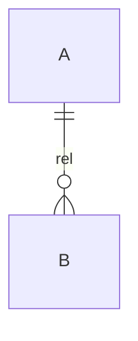
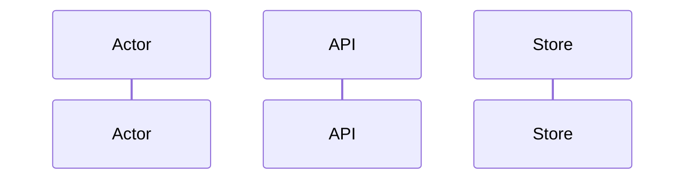
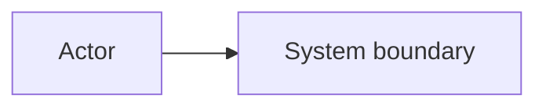

# Design Artifact Template

Write `{workspace}/.engineering-hld/{slug}/design.md`, then publish to
`<module>/docs/architecture/engineering-hld-design.md` (see
[close.md](../close.md)). Replace the file for the same slug. Remove
inapplicable sections; every remaining heading is filled.
Heading order is contract-first, then spine records.

````markdown
# Engineering HLD: [decision/system]

**Mode:** Full HLD | Single lever | Critique
**Grounding:** Grounded | Draft
**Decision status:** Decided | Blocked
**Scope:** [included boundary]; excludes [explicit exclusions]

## Decision
[One paragraph: chosen architecture/lever or critique verdict and why.]

## Evidence ledger
| Input | Value | Class | Source |
|---|---:|---|---|
| [peak load] | [value + unit] | Measured/Sourced/Assumption/TBD | [path, telemetry window, or user statement] |

## Functional requirements
- [Actor] should be able to [capability].

## Non-functional requirements
- The system should [quantified quality, named operation].

## Core entities
[FR nouns only. Prune attributes and admit machinery. See contract-first.md.]



| Entity | Identity | Invariants | Relationships | Lifecycle |
|---|---|---|---|---|

## APIs
REST default. Plural resources from entities. Principal from auth.

| API | Method / event | Request | Response | Idempotency | AuthZ | Failure |
|---|---|---|---|---|---|---|

## Data flow
[Pipeline sequence, or “short request/reply — omitted.”]



## Council
| Candidate | Member | Extra boxes | Verdict |
|---|---|---|---|

**Winner:** [candidate] because [fewest extra boxes among FR-complete candidates].
Losers are Rejected alternatives. Raw files: `.engineering-hld/{slug}/council/`.

## High-level design


[Walk each API. Component responsibilities. Callouts for unevaluated caches/queues.]

## Data model
[Fields that matter, next to the store. Core entities first; admit machinery labeled as such.]

| Entity | Store | Table/collection | Keys | Attributes | Cardinality | Consistency |
|---|---|---|---|---|---|---|

## Capacity envelope
`[formula] = [substituted values] = [result with unit]`

Sanity checks: [peak vs average, skew, amplification]. Omit if no box depends on it.

## First bottleneck
[Resource/invariant, evidence or hypothesis, saturation, user impact, confirming metric.]

## Names
| Kind | Name | Bound to | Orthography source |
|---|---|---|---|
| Service / table / attribute | | entity, API, or store | workspace or earn.md default |

## Cloud map
| Earned component | Provider | Platform service | Why this mapping | Account/region |
|---|---|---|---|---|

Provider and account/region are Sourced or TBD.

## Deep dives
| Component | First bottleneck | Saturation | Confirming metric | Kill condition or surplus evidence |
|---|---|---|---|---|

## Decisions
| Decision | Evidence that earned it | Simpler alternative | Why insufficient | Rollback/revisit |
|---|---|---|---|---|

## Rejected alternatives
| Alternative | Rejection reason under current evidence | Revisit when |
|---|---|---|

## Failure model and recovery
| Failure | Detection | Containment/recovery | User behavior | Owner |
|---|---|---|---|---|

**Accepted failure:** [failure] because [mitigation costs more than current impact].

## Security and observability
- **AuthN/AuthZ/trust boundaries:**
- **Data sensitivity, tenancy, retention/deletion:**
- **SLIs and saturation signals:**
- **Logs/traces/alerts and owner:**

## Rollout and rollback
[Migration compatibility, canary, validation, rollback trigger and path.]

## Cost and complexity tax
- **Primary cost drivers:**
- **Deliberately not built:**

## Falsification
| Kill condition | Signal and threshold | Window | Consequence |
|---|---|---|---|

## Diagram exports (optional)
- **High-level diagram:** [workspace path]
- **Detailed diagram:** [workspace path]

## Open blockers
[Only unresolved decisions that prevent approval.]
````

## Mode adaptations

### Full HLD

Fill FR, NFR, entities, APIs, data flow (or an omit line), Council, HLD, data model,
capacity when it earns a box, bottleneck, names, cloud map, deep dives.
Scaling path and cost stay in Decisions / tax.

### Single lever

Keep Decision, Evidence, Capacity, First bottleneck, Deep dives (the lever),
Decisions, Rejected, Failure, Rollout, Complexity tax, Falsification, and
Diagram exports. Replace HLD-body with:

```markdown
## Current and proposed path
[Minimal Mermaid only if topology changes.]

## Option comparison
| Option | Expected metric effect | Correctness impact | Operational cost | Verdict |
|---|---:|---|---|---|
```

Compare only viable options for the metric being changed. Names or Cloud map
only when the lever introduces a service, table, or attribute.

### Critique

Lead with:

```markdown
## Findings
| Severity | Type | Evidence | Impact | Minimal remedy | Reversal evidence |
|---|---|---|---|---|---|
```

Then recomputed Capacity plus [critique](../critique.md) findings. Corrected Mermaid only
when a remedy needs an unambiguous topology.
