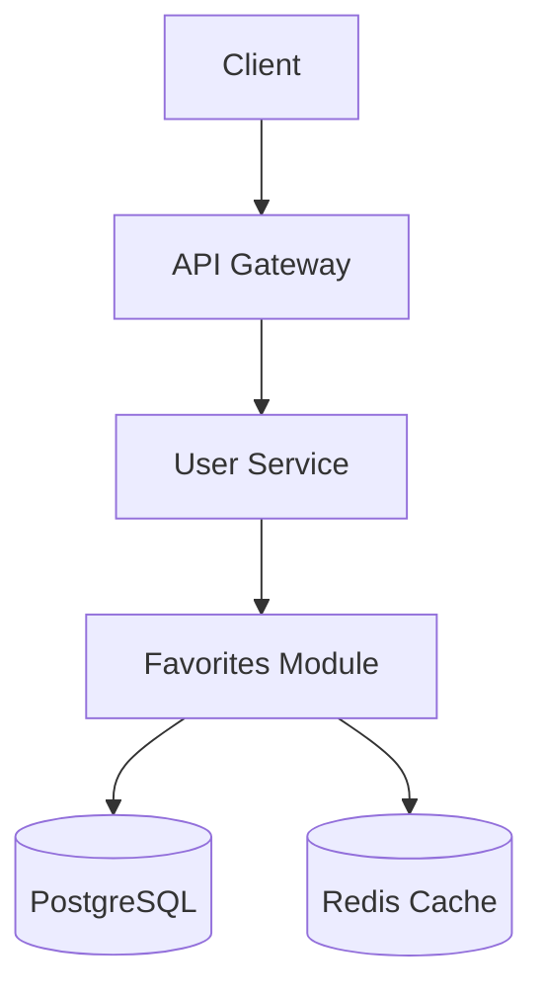

 
# Phase 1A: Discovery & Core Design
 
## Purpose
Establish the foundation of the technical design through discovery, architecture decisions, and core data model.

## Output
A lightweight design document (~300 lines) that answers:
- What problem are we solving and for whom?
- What's the high-level architecture approach?
- What are the core entities and their relationships?
 
## Core Principles
 
### Never Assume - Ask or Spike
```
If you don't know a technical detail, ASK or SPIKE — never silently assume.

ASK the user when the detail is a product/context decision only they hold:
- "What version of [framework] are you using?"
- "Do you have an existing pattern for [feature]?"
- "What's your current database schema for [entity]?"
- "What's the expected scale? (requests/sec, data volume)"

SPIKE (verify empirically) when the detail is a verifiable fact about code,
a library, an API, or runtime behavior — the user usually can't answer these
reliably from memory, and a wrong guess silently corrupts the design:
- "Does this SDK's tool_result content accept a document block?"
- "What fields does this API response actually return?"
- "Does this adapter raise on an unknown type, or ignore it?"
- "Is this method async? What's its real signature?"
```

### Verify with a Spike

A **spike** is a small, time-boxed investigation that replaces an assumption with
**evidence** before the design depends on it. Spikes are first-class and encouraged in
any phase — design assumptions about external/library/runtime behavior are the most common
source of expensive rework, and they are cheap to disprove early.

**When to run a spike (instead of guessing or asking):**
- The design hinges on a **claim about third-party behavior** (SDK/library/API shape,
  error semantics, capability support, version differences).
- You're about to write "I believe X but I'm not certain" or "this may not be supported" —
  that uncertainty is a spike trigger, not a caveat to ship.
- A constraint would meaningfully change the architecture **if** it turned out to be true
  (or false).
- Two reasonable people could disagree about a factual detail that a 5-minute experiment
  settles.

**How to run a spike (ground in authoritative sources, in priority order):**
1. **Inspect the actual installed code/types.** Read the real SDK/library source or type
   definitions for the version the project pins (e.g. `uv run python -c "import X; ..."`,
   read the installed `.py`/`.d.ts`/`.pyi`). This is the highest-confidence evidence.
2. **Run a minimal reproduction.** A few lines that exercise the exact behavior in question.
3. **Read official docs / changelogs** for the pinned version — note version-specific
   caveats and beta/feature flags.
4. **Web search last, and distrust it.** Blog posts and forum answers are often outdated or
   wrong; only use them to find leads, then confirm against (1)–(3). If a source contradicts
   the installed code, the installed code wins.

**Record the result in the design doc** so it's auditable and not re-litigated:
- State what was verified, the **evidence** (SDK version + type/source snippet, repro output),
  and the **implication** for the design.
- If the spike **retired** a prior assumption/constraint, say so explicitly (supersede it;
  don't leave the stale concern lurking elsewhere in the doc).
- Add a line to the design's **References** pointing at the artifact (file path, SDK version,
  symbol inspected).

**Keep it time-boxed.** A spike answers one factual question. If it balloons into open-ended
exploration, stop and surface the uncertainty to the user as an explicit open decision instead.

### Top 1% Quality Standards
Designs must address:
- **Performance**: Query optimization, caching, async operations
- **Scalability**: Can handle 10x growth without architecture changes
- **Security**: Auth, authorization, input validation, data protection
- **Maintainability**: Clear patterns, minimal complexity, good abstractions
 
### Follow Existing Patterns
```
ALWAYS read existing code before proposing new patterns.
If the codebase uses Repository pattern, use Repository pattern.
If the codebase uses functional style, use functional style.
Consistency > personal preference.
```
 
## Phase 1A Process

### Step 0: Codebase Analysis (Before Asking Questions)

> **Why first?** The "Follow Existing Patterns" principle says to read existing code before proposing anything — but without a structured checklist, this becomes ad-hoc. Performing this analysis *before* discovery questions lets the agent ask better questions informed by what already exists.

Perform this analysis silently (do not output a separate document — embed findings into the discovery doc):

#### 0a. Top-Level Structure Scan
- Read the workspace root directory listing (top-level files and folders)
- Identify the project type (monorepo, single app, library, CLI, etc.)
- Identify the primary language(s) and framework(s) from config files (`package.json`, `pyproject.toml`, `pom.xml`, `go.mod`, `*.csproj`, etc.)
- Note the dependency management approach and key dependencies
- **Write `detected_stack` to state.json** — detect the language, framework, and version from config files:

  | Config File | Look For | `detected_stack` Values |
  |-------------|----------|------------------------|
  | `pom.xml` / `build.gradle` | `spring-boot-starter-*` | `language: "java"`, `framework: "spring-boot"` |
  | `pom.xml` / `build.gradle` | `io.quarkus` / `quarkus-bom` | `language: "java"`, `framework: "quarkus"` |
  | `pom.xml` / `build.gradle` | `io.micronaut` | `language: "java"`, `framework: "micronaut"` |
  | `pyproject.toml` / `requirements.txt` | `fastapi` | `language: "python"`, `framework: "fastapi"` |
  | `pyproject.toml` / `requirements.txt` | `django` | `language: "python"`, `framework: "django"` |
  | `pyproject.toml` / `requirements.txt` | `flask` | `language: "python"`, `framework: "flask"` |
  | `package.json` | `@angular/core` | `language: "typescript"`, `framework: "angular"` |
  | `package.json` | `react` (without `next`) | `language: "typescript"`, `framework: "react"` |
  | `package.json` | `next` | `language: "typescript"`, `framework: "nextjs"` |
  | `*.csproj` | `Microsoft.AspNetCore` | `language: "csharp"`, `framework: "aspnet-core"` |
  | `*.tf` files | HCL syntax | `language: "hcl"`, `framework: null` |

  Extract the framework version from the dependency version in the config file (e.g., Spring Boot 3.3.0, FastAPI 0.110.0). Set `framework_version` to `null` if the version cannot be determined.

  **Cloud provider detection** (for Terraform/IaC projects): When `language` is `hcl`, also detect the cloud provider from the Terraform provider configuration and resource prefixes:

  | Signal | `cloud_provider` Value |
  |--------|----------------------|
  | `required_providers` block contains `hashicorp/aws`, or resources use `aws_*` prefix | `"aws"` |
  | `required_providers` block contains `hashicorp/google`, or resources use `google_*` prefix | `"gcp"` |
  | `required_providers` block contains `hashicorp/azurerm`, or resources use `azurerm_*` prefix | `"azure"` |
  | Multiple providers or none detected | `null` (multi-cloud or undetermined) |

  Set `cloud_provider` to `null` for non-IaC projects.

#### 0b. Similar Feature Module Analysis
- Search for 2-3 existing feature modules most similar to the requested feature (by domain or pattern)
- For each module, read its entry point and note:
  - File/folder structure (e.g., controller → service → repository, or component → hook → API layer)
  - Naming conventions (file names, class names, function names)
  - How state is managed, how data flows, how errors are handled
  - How the module is wired into the application (routes, DI, module registration)
- Summarize the established patterns in a "Codebase Conventions" subsection of the design doc

#### 0c. Test & Config Conventions
- Find the test directory structure and read 1-2 existing test files to identify:
  - Testing framework and assertion style
  - Test file naming convention (e.g., `*.test.ts`, `*_test.go`, `test_*.py`)
  - Common test utilities, fixtures, or factories
  - How mocks/stubs are set up
- Read CI/CD config if present (`.github/workflows/`, `Jenkinsfile`, `.gitlab-ci.yml`, etc.) to understand the build/test pipeline
- Identify existing security controls in CI/CD:
  - SAST (e.g., SonarQube, CodeQL, Semgrep)
  - Dependency / SCA scanning (e.g., OWASP Dependency-Track, Dependabot)
  - Secret scanning (e.g., gitleaks)
  - Container/IaC scanning (e.g., Trivy, checkov)
  - Document findings in "Codebase Conventions → Security Tooling"

#### 0d. Database & Schema Conventions (if applicable)
- Find existing migration files or schema definitions to identify:
  - Migration tool in use (Flyway, Alembic, Knex, Prisma, EF Migrations, etc.)
  - Migration naming convention
  - Whether migrations are SQL-based or code-based
- This informs the migration strategy in Phase 1C

**Output from Step 0:** A "Codebase Conventions" subsection in the 1a-discovery.md doc that captures:
- Project structure and stack
- Established architectural patterns (from similar modules)
- Naming and file organization conventions
- Test framework and conventions
- Migration tool and conventions (if applicable)
- Security tooling in CI/CD (SAST, SCA, secret scan, IaC scan)

This subsection ensures the design builds on existing patterns rather than inventing new ones.

### Step 0.4: Consume `@monkeyplan` requirements (if present)

If `{workspace}/.monkeymode/{feature-name}/prt.md` exists (copied there by `@monkeyplan`'s handoff), read it, and `epic-breakdown.md` if present, before asking discovery questions.

1. **Pre-answer discovery.** Requirements, personas, scope boundaries, success metrics, and constraints in the PRT are already known. Do not re-ask them; confirm in one line what you carried over and ask only about gaps.
2. **Seed stories later.** Note the epic and story structure from `epic-breakdown.md` so Phase 2A builds on it instead of starting from a blank page.
3. **The user still wins.** If the user contradicts the PRT during discovery, follow the user and note the divergence.

If neither file exists, this step is a no-op.

### Step 0.5: Consume `design-context.md` (if present)

> **Why here?** The `@design-context` skill may have already mapped this requirement onto the existing system landscape and emitted a shared context bus *before* MonkeyMode ran. When that artefact exists, MonkeyMode should pre-seed from it rather than re-deriving the same axes — the design-context skill decides, MonkeyMode enforces and builds. When it is absent, this step is a no-op and Step 0 detection / Step 1 discovery proceed exactly as before.

This step follows the **read-if-present contract** defined in the `design-context` skill's `consuming-design-context.md` guide. Do not block, warn, or error if the artefact is missing.

1. **Locate the bus.** Look for `{workspace}/.design-context/{feature-name}/design-context.md` (match on the MonkeyMode feature name; if `@design-context` used a slightly different kebab-case slug, match on similarity, else treat as absent).
2. **If absent → no-op.** Proceed with Step 0 detection and Step 1 discovery as normal. This is the steady state for features that skipped `@design-context`.
3. **If present:**
   - Parse the **single fenced ` ```json ` block** (the source of truth — not the surrounding markdown). If the block is missing or fails to parse, treat the artefact as absent and continue normally.
   - **Pre-seed `state.json.context.detected_stack`** from `tech_axis.detected_stack` and `platform_axis` (language, framework, framework_version, build_tool, test_framework, platform, platform classification). Skip re-deriving any field the bus already resolved; for the cloud provider, seed from `cloud_framework_axis.clouds` (use the single cloud when `clouds[]` has one entry; leave `cloud_provider: null` for multi-cloud and let the new `architectural_guidance.clouds` carry the full list).
   - **Populate `state.json.context.architectural_guidance`** (see SKILL.md state schema) from the bus: `clouds`, `domains`, `pillar_profile`, `framework_checks`, `contract_delta`, `integration_style`, and `degradation_notes`.
   - **Honour degraded axes.** For any axis listed in `degradation_notes` as degraded, do **not** treat its values as authoritative — re-derive them through normal discovery, and **surface the degradation note to the user verbatim** at the top of the discovery output.
   - **Feed the contract delta forward.** Carry `semantic_axis.contract_delta` into Phase 1B (and contract-test generation) so the "external dependencies" come from the design-context analysis rather than from discovery-question guesses.
   - **Skip pre-answered platform questions.** Where `platform_axis.pre_answered_questions` already answers a Step 1 platform discovery question, use the recorded answer and source instead of asking the user again.
4. **Announce what was pre-seeded.** Tell the user which fields came from `design-context.md` and which axes were degraded (and therefore still need discovery), so the provenance is visible.

> **The bus never overrides the user.** Pre-seeded values are a starting point. If the user contradicts a bus value during discovery, follow the user and note the divergence — never silently keep a stale bus value.

### Step 1: Discovery Questions

#### Platform-Specific Discovery (pre-pended when a platform supplement is loaded)

> **Gate:** This block runs only when `state.json.context.detected_stack.platform_supplement_loaded == true`. The trigger is the supplement's loaded status, **not** `platform != null` — see [SKILL.md → Platform Supplement Degradation Policy](../SKILL.md#platform-supplement-degradation-policy).

- **If `platform_supplement_loaded == true`:** Pre-pend the questions from the loaded platform supplement's `§10 Discovery questions` section before the general discovery blocks below. Answer each platform question from the supplement's normative tables wherever possible (registries, region tables, environment tables); only escalate to the user when the supplement cannot answer the question.
- **If `platform_supplement_loaded == false` AND `platform != null`:** Skip the pre-pend. Surface every entry from `state.json.context.detected_stack.platform_supplement_warnings` at the top of the discovery output, and add this explicit note: *"Platform-specific discovery questions were not asked because the supplement is missing — this design will not be checked against platform invariants until the supplement lands."*
- **If `platform == null`:** Do nothing — proceed straight to the general discovery blocks below.

#### Business Context
- What problem does this solve for users?
- What's the expected user impact? (how many users, how often)
- What are the success metrics?
- What's explicitly OUT of scope?
 
#### Technical Context
- What's the tech stack? (ask for specific versions)
- What's the current architecture pattern?
- Are there similar features we can reference?
- What's the current data model?
- What are the existing API patterns?
- What's the deployment model? (monolith, microservices, serverless)
- What's the current scale? (users, requests, data volume)
- What testing frameworks and patterns are used?
 
#### Scale & Load Questions
- What's the current request volume? (req/sec)
- What's the expected growth rate? (monthly/yearly)
- Peak vs average load ratio?
- Read/write ratio for this feature?
- Data growth rate? (records/day, GB/month)
- Geographic distribution of users?
 
#### Integration Context
- What other services/systems are involved?
- What events need to be published/consumed?
- What external APIs are needed?
- What shared data stores exist?
- What are the SLAs for dependent services?
 
#### Compliance Context
- Is there PII involved? What type?
- What data retention requirements exist?
- Are there audit logging requirements?
- GDPR/CCPA or other regulatory requirements?

#### Security Context
- What is the data classification for data touched by this feature? (public / internal / confidential / restricted / PII / PHI / PCI)
- What are the trust boundaries? (browser → API → service → DB → third parties)
- What authentication mechanism is in use? (OIDC, SAML, API keys, mTLS, session cookies)
- What authorization model applies? (RBAC, ABAC, resource ownership, multi-tenant isolation)
- Who are the threat actors? (anonymous users, authenticated users, insiders, compromised dependencies)
- What are the top 3 abuse scenarios for this feature? (IDOR, privilege escalation, injection, SSRF, data exfiltration)
- Are there regulatory or org security standards to comply with? (OWASP ASVS level, SOC2, HIPAA, PCI-DSS)
- Does the org already run SAST/SCA/secret scanning in CI? Which tools?
 
### Step 2: Architecture Design
 
#### CRITICAL: Visual Overview Required
**ALWAYS create a visual diagram FIRST before detailed design.**
 
Choose the most appropriate visual for the design:
- **Architecture Diagram**: For system components and their relationships
- **Sequence Diagram**: For request/response flows and interactions
- **Data Flow Diagram**: For data movement through the system
- **State Diagram**: For state machines or workflow processes
 
Use ASCII for simplicity or Mermaid for richer diagrams:
 
**ASCII Example:**
```
┌─────────────┐
│   Client    │
└──────┬──────┘
       │ HTTPS
       ▼
┌─────────────────────────────────┐
│      API Gateway / LB           │
└────────────┬────────────────────┘
             │
             ▼
┌─────────────────────────────────┐
│       User Service              │
│  ┌──────────────────────────┐   │
│  │  Favorites Module        │   │
│  │  - Controller            │   │
│  │  - Service               │   │
│  │  - Repository            │   │
│  └──────────┬───────────────┘   │
└─────────────┼───────────────────┘
              │
              ▼
       ┌─────────────┐
       │  PostgreSQL │
       │  - users    │
       │  - favorites│
       └─────────────┘
```
 
**Mermaid Example:**

 
#### Approach Selection
Present 2-3 approaches with:
- **Description**: How it works
- **Pros**: Benefits and strengths
- **Cons**: Drawbacks and limitations
- **Recommendation**: Which to choose and why
 
Example:
```markdown
### Approach A: Dedicated Favorites Service
**Pros:**
- Clean separation of concerns
- Independent scaling
- Can be owned by different team
 
**Cons:**
- Operational overhead (deployment, monitoring)
- Network latency for favorites checks
- More complex local development
 
**Recommendation:** Only if favorites will have complex logic (recommendations, ML, etc.)
 
### Approach B: Favorites Module in User Service
**Pros:**
- Simple deployment
- No network calls for user+favorites queries
- Easier local development
 
**Cons:**
- User service grows in scope
- Coupled scaling (can't scale favorites independently)
 
**Recommendation:** ✅ Choose this for MVP - simple, fast, meets requirements
```
 
#### Architecture Decision Record (ADR)
For significant decisions, create an ADR:
 
```markdown
### ADR-001: [Decision Title]
 
**Status:** Proposed | Accepted | Deprecated | Superseded
**Date:** [YYYY-MM-DD]
**Deciders:** [List of people involved]
 
**Context:**
[Why this decision is needed. What forces are at play.]
 
**Decision:**
[What we decided to do.]
 
**Consequences:**
- **Positive:** [Benefits gained]
- **Negative:** [Trade-offs accepted]
- **Risks:** [Potential issues to monitor]
 
**Alternatives Considered:**
| Option | Pros | Cons | Why Not Chosen |
|--------|------|------|----------------|
| [Alt 1] | ... | ... | ... |
| [Alt 2] | ... | ... | ... |
```

#### Architecture Evaluation Rubric

When comparing alternatives, evaluate each option against these five dimensions. This produces consistent, auditable decisions rather than ad-hoc pros/cons.

**Apply to each alternative being considered:**

| Dimension | Question | What Good Looks Like |
|-----------|----------|---------------------|
| **Replaceability** | Can this component be swapped without rewriting its consumers? | Depends on interfaces, not implementations. Switching from Postgres to DynamoDB changes only the repository layer. |
| **Cognitive Load** | Can a new team member understand this in one sitting? | Clear boundaries, predictable patterns, no hidden side effects. If explaining it requires a whiteboard session, it's too complex. |
| **Risk Isolation** | If this component fails, what's the blast radius? | Failures are contained to the component. A cache failure degrades performance but doesn't break the system. |
| **Future Flexibility** | What's the cost of the most likely future change? | Identify the 2-3 most probable future requirements. The chosen approach should accommodate them without architectural rework. |
| **Security Posture** | What is the attack surface and blast radius? | Least privilege, defense in depth, fail-closed auth, no secrets in code, input validated at every boundary. |

**How to use:** Score each alternative as Strong / Adequate / Weak per dimension. The winning alternative doesn't need to score Strong on everything — but any Weak score should be called out as a conscious trade-off in the ADR's Consequences section.

**Example evaluation (inline with alternatives table):**

```markdown
| Dimension | Approach A: Microservice | Approach B: Module | 
|-----------|-------------------------|-------------------|
| Replaceability | Strong — independent deploy | Strong — interface-separated |
| Cognitive Load | Weak — distributed system complexity | Strong — single codebase |
| Risk Isolation | Strong — isolated failure domain | Adequate — shared process |
| Future Flexibility | Strong — independent scaling | Adequate — requires extraction later |
| Security Posture | Adequate — standard auth at gateway | Strong — fewer network hops, smaller surface |
| **Verdict** | Over-engineered for MVP | ✅ **Chosen** — simpler, adequate for now |
```

> **Keep it lightweight:** The rubric is a thinking tool, not a documentation ceremony. For simple decisions (e.g., "which library for JSON parsing"), skip the rubric. Use it for decisions that affect module boundaries, data flow, or deployment topology.
 
### Step 3: Data Model Design (Core Entities Only)
 
#### Entity Definition
For each entity, specify:
```markdown
[EntityName]
├── id: uuid (PK) - Unique identifier
├── [field]: [type] - [description, constraints]
├── created_at: timestamp - Record creation time
└── updated_at: timestamp - Last modification time
 
Relationships:
- [entity] has many [related_entity] (1:N)
- [entity] belongs to [related_entity] (N:1)
- [entity] has many [related_entity] through [join_table] (M:N)
 
Indexes:
- PRIMARY KEY (id)
- INDEX idx_[table]_[column] ON [table]([column]) - [reason for index]
- UNIQUE INDEX idx_[table]_[columns] ON [table]([col1], [col2]) - [reason]
 
Constraints:
- FOREIGN KEY (user_id) REFERENCES users(id) ON DELETE CASCADE
- CHECK ([column] > 0)
```
 
**Note:** Keep it simple for Phase 1A. Detailed lifecycle, compliance, and migration strategy (migration ordering, rollback DDL, data backfill, zero-downtime checklist) will be covered in Phase 1C, Step 7.
 
## Output Document Structure
 
```markdown
# Design: [Feature Name] - Phase 1A
 
## Executive Summary
[2-3 sentences for stakeholder presentation]

## Codebase Conventions
[From Step 0 — project structure, established patterns, naming/file conventions, test conventions, migration tool]

### Detected Stack
- **Language:** [e.g., Java 21]
- **Framework:** [e.g., Spring Boot 3.3.0 / Quarkus 3.8.0 / FastAPI 0.110.0]
- **Build Tool:** [e.g., Gradle 8.x / Maven 3.9.x / Poetry / npm]
- **Cloud Provider:** [e.g., AWS / GCP / Azure / null — only for IaC projects]

## Use Case & Business Value
[What we're building and why - from discovery questions]
 
## Architecture Decision
 
### Chosen Approach
[Detailed description with diagram]
 
### Alternatives Considered
[Table with options, pros, cons, why not chosen]
 
### Architecture Diagram
[ASCII or Mermaid diagram]
 
## Core Data Model
 
### Entities
 
#### [Entity 1]
[Definition with fields, relationships, indexes, constraints]
 
#### [Entity 2]
[Definition with fields, relationships, indexes, constraints]
 
## Next Steps
- Phase 1B: Define API contracts, integration points, and testing strategy
- Phase 1C: Address security, performance, and operational concerns
```
 
## Quality Checklist for Phase 1A
 
Before moving to Phase 1B, verify:
 
### Completeness
- [ ] Codebase analysis performed (Step 0) — conventions documented
- [ ] `detected_stack` written to state.json (language, framework, version)
- [ ] At least 2 similar modules analyzed for existing patterns
- [ ] All discovery questions answered (or marked as assumptions)
- [ ] Visual diagram included
- [ ] Architecture decision is clear with alternatives documented
- [ ] Core entities defined with relationships
 
### Quality
- [ ] Architecture decision is justified
- [ ] Alternatives are documented
- [ ] Security context discovery questions answered (data classification, trust boundaries, abuse scenarios)
- [ ] Architecture evaluation rubric applied for significant decisions (Replaceability, Cognitive Load, Risk Isolation, Future Flexibility, Security Posture)
- [ ] Diagram is clear and accurate
- [ ] No ambiguous requirements
- [ ] No assumptions without clarification
- [ ] Every claim about third-party/library/API/runtime behavior is either spike-verified (evidence recorded) or flagged as an explicit open decision — no unverified "I believe / this may not be supported" claims left in the design

### Clarity
- [ ] Can a developer understand the high-level approach?
- [ ] Are the core entities and their purpose clear?
- [ ] Is it obvious why this approach was chosen?
 
## Anti-Patterns to Avoid
 
❌ **Assuming without asking**
```
"We'll use Redis for caching"
→ Ask: "Do you already have Redis? What's your caching strategy?"
```

❌ **Shipping an unverified library/API assumption as a caveat**
```
"The SDK probably doesn't allow a document block inside tool_result, so we'll
 add a text-only fallback (constraint for later)."
→ Spike it: inspect the installed SDK types / run a repro. The constraint was
 false — both content unions accept the block. A 5-minute spike removed an
 entire fallback path and the rework it would have caused.
```
 
❌ **Over-engineering**
```
"We'll build a microservice with event sourcing and CQRS"
→ Start simple, add complexity only when needed
```
 
❌ **Ignoring existing patterns**
```
"Let's use a new ORM for this feature"
→ Use the ORM the codebase already uses
```
 
❌ **Vague requirements**
```
"The API should be fast"
→ Define: "p95 latency < 200ms under 1000 req/s load"
```
 
## Timeline Guidance
 
| Complexity | Discovery | Design | Review | Total |
|------------|-----------|--------|--------|-------|
| Simple feature | 15-30 min | 30-45 min | 15 min | 1-1.5 hours |
| Medium complexity | 30-45 min | 45-60 min | 30 min | 2-2.5 hours |
| Complex system | 1-2 hours | 2-3 hours | 1 hour | 4-6 hours |
 
## Definition of Done
 
Phase 1A is complete when:
- [ ] Codebase analysis performed and conventions documented
- [ ] All discovery questions answered
- [ ] Visual diagram created and reviewed
- [ ] Architecture decision made and documented
- [ ] Core data model defined
- [ ] User approves direction: "Yes, this approach makes sense"
- [ ] Document saved to `.monkeymode/{feature-name}/design/1a-discovery.md`

Critique is optional — only if the user asks; see `{skill_dir}/monkeymode/guides/PHASE-CRITIQUE-LOOP.md`.

 