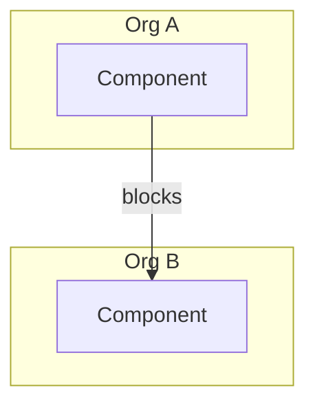

# Technical Blueprint: {Feature Name}

**Source PRD:** `{prd_path}`
**Prototype:** `{prototype_status} — {prototype_path or "n/a"}`
**SiteMap source:** `{sitemap_source}`
**Orgs in scope:** `{orgs_in_scope}`
**Artifact store:** `{artifact_store.type} → {artifact_store.path}`
**Detected stack:** `{stack summary or "greenfield"}`
**Generated:** {ISO8601}
**Tracker:** `{Capability / tracking-epic key(s) once synced to your issue tracker — see §5; "not synced" otherwise}`
**Status:** Draft → pending Scope sign-off

> Intermediate technical blueprint produced by `@scope`, sitting between PRD and @monkeyplan.
> Conceptual architecture, estimates, multi-org dependencies, and risk — **not** file/function-level design (that is `@monkeymode`).

---

## Executive Summary

> The one-screen brief for the Scope review — written so the room (Eng + Product + Design) can review, challenge, and sign off in minutes **without** reading §1–§5 first. Every claim below is expanded in the section noted in parentheses. Keep it skimmable: short sentences, concrete numbers, no jargon a PM wouldn't use.

**What this is:** {1–2 sentences — the feature and the engineering plan in plain language. What are we committing to build, for whom?}

**Why now / the core shift:** {1–2 sentences — the problem this solves and what changes for users or the business once it ships. The "so what" that justifies the spend.}

**Orgs / teams in scope:** {from §3.4 — who must join planning. This is the line a PM scans first on a multi-org feature.}

**What we're building ({N} epics):**
1. **{Candidate epic 1}** — {one-line outcome} *({org}/{team})* *(§2.1)*
2. **{Candidate epic 2}** — {one-line outcome} *({org}/{team})*
3. {…one bullet per candidate epic — this is the scope at a glance}

**Size & shape:** ~{N}–{M} epics → ~{S1}–{S2} sprints → ~{PW1}–{PW2} person-weeks (3-person team). {If scope can be staged, name the minimum viable slice and its smaller size.} *(§2)*

**Recommended sequencing:** {What ships first and why; which epics run in parallel; the fastest path to user-visible value. One or two sentences.} *(§2.2 / §5.3)*

**Most complex / top risk:** **{Epic or area}** — {one-line why it dominates the schedule or carries the most risk}. De-risk by {spike / early contract / prototype / pilot}. *(§2.3, §5.1)*

**Cross-org prerequisites (hard gates):** {What must already be true or landed before sprint 1 — upstream epics from another org, named owners, infra, signed contracts. Write "None — single org" if there are none.} *(§3.3 / §3.5)*

**In scope:** {crisp comma-separated list of what this blueprint delivers}
**Explicitly NOT in scope:** {crisp list of what it deliberately does not do — so no one in the room wrongly assumes it} *(§5.2)*

**Key decisions needed from the room:**
- {Decision-shaped question 1 the team/PM must answer to proceed — phrased so it can be settled in the meeting} *(§4.2)*
- {Decision-shaped question 2}
- {…the 2–5 questions that actually block or reshape the plan; full list in `open-questions.md`}

**Status:** Draft — pending Engineering / Product / Design sign-off (see Scope Sign-Off below). {Note any blocker to sign-off.}

---

## 1. High-Level System Design

### 1.1 Conceptual Architecture
**Pattern:** {chosen pattern}

{2–4 bullets justifying the choice against specific PRD requirements and stack constraints}

### 1.2 Core Components

**Backend**
| Component | Responsibility | Org | Owning team / repo |
|-----------|----------------|-----|--------------------|
| | | | |

**Frontend** *(omit if non-UI — state why)*
| Component | Responsibility | Org | Owning team / repo |
|-----------|----------------|-----|--------------------|
| | | | |

### 1.3 Data Flow
1. {trigger} → ...
2. ...
3. ...

*(Alternate/error path):* ...

### 1.4 Data Storage Strategy
| Concern | Recommendation | Justification |
|---------|----------------|---------------|
| Primary store | | |
| Cache | | |
| Search / analytics | | |
| Object / blob | | |

---

## 2. Effort Estimation & Resource Scoping

**Overall size:** ~{N}–{M} Epics → ~{S1}–{S2} sprints → ~{PW1}–{PW2} person-weeks (3-person team)
**Basis:** {what drives the range}

### 2.1 Candidate Epics *(for @monkeyplan to formalize)*
| # | Candidate Epic | Size (S/M/L) | Owning org / team | Notes |
|---|----------------|--------------|-------------------|-------|
| 1 | | | | |

### 2.2 Breakdown by Discipline *(2-week MonkeyMode cycle)*
| Discipline | Rough effort | Sprint(s) | Notes |
|------------|--------------|-----------|-------|
| Frontend | | | |
| Backend | | | |
| DevOps / Infra | | | |
| QA | | | |

### 2.3 Most Complex Epic
**{Epic name}** — {why it dominates the schedule}.
**De-risk by:** {spike / early contract / prototype}.

---

## 3. Dependency Interrogation & Multi-Org Scope

### 3.1 Internal Dependencies
| Dependency | Type | Consume/Modify | Org | Owning team | Repo | Match basis | Notes |
|------------|------|----------------|-----|-------------|------|-------------|-------|
| | | | | | | provides/alias/catalog/user | |

### 3.2 External Dependencies
| Dependency | Category | Why needed | Integration risk | Contract/SLA? |
|------------|----------|------------|------------------|---------------|
| | | | | |

### 3.3 Blocking Dependencies
| Blocker | Blocks Epic(s) | Org / owner / vendor | Unblock condition | Parallelizable now |
|---------|----------------|----------------------|-------------------|--------------------|
| | | | | |

### 3.4 Impacted Teams *(for PMs)*
| Org | Team | Why involved | Repos | Must join planning? | Confidence |
|-----|------|--------------|-------|---------------------|------------|
| | | | | | |

### 3.5 Per-Org Scopes
#### {Org} — Scope slice
- **Outcome:** …
- **Candidate epics:** …
- **Repos:** …
- **Depends on (other orgs):** …

| From org | To org | Dependency | Blocking? |
|----------|--------|------------|-----------|
| | | | |

---

## 4. Scope Clarification & Edge Cases

### 4.1 Critical Gaps
| # | Gap | Lens | Why it matters |
|---|-----|------|----------------|
| 1 | | edge/scaling/security/ops | |

### 4.2 Questions for the Product Manager *(also in `open-questions.md`)*
| # | Question | Decision it unblocks | Default if no answer |
|---|----------|----------------------|----------------------|
| 1 | | | |

---

## 5. Architectural Safeguards (Pre-@monkeyplan Preparation)

### 5.1 Technical Assumptions
| # | Assumption | Affects | Invalidated if... |
|---|------------|---------|-------------------|
| 1 | | | |

### 5.2 Architectural Boundaries — NOT in Phase 1
**In Phase 1:** {in-scope core}

**Explicitly NOT in Phase 1:**
- {deferred capability + reason}

### 5.3 Inputs @monkeyplan Needs Next
| Input @monkeyplan needs | Source | Status |
|-----------------|--------|--------|
| Candidate Epic list + sizes + owning org/team | §2.1 | ready |
| Impacted teams | §3.4 | ready |
| Per-org scopes + blockers | §3.5 / §3.3 | ready |
| Resolved PM answers | §4.2 | pending PM |
| Data model / API contract shapes | §1.3–1.4 | |
| Stack decision (if greenfield) | §1.1 | |
| SiteMap | `sitemap.yaml` | {source} |
| Prototype | Phase 0 | {status} |
| Artifact store | Phase 0 | {type/path} |
| Tracker capability / epic stubs | tracker sync (§5 handoff) | {keys, or "not synced"} |

---

## Scope Sign-Off
| Role | Signed | By | When |
|------|--------|----|------|
| Engineering | ☐ | | |
| Product | ☐ | | |
| Design | ☐ | | |

**Next:** `@monkeyplan for {feature-name}` once all three are signed and §5.3 `pending` items are cleared. If tracker stubs were created, `@monkeyplan` formalizes them rather than recreating epics.
