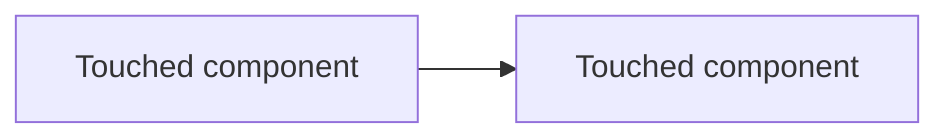

# Story draft template

Copy this shape into the chat (or a file the user names). Replace bracketed text.

## Summary

[One sentence: what this story delivers and why]

## Scope of Work

- [Concrete task 1]
- [Concrete task 2]

Out of scope: [explicitly excluded items, if any]

## Dependencies

| Team/Repo | Dependency | Blocking? | Notes |
|---|---|---|---|
| [team] | [what's needed from them / what they need from this] | Yes/No | |

If none: `No cross-team dependencies identified.`

## Repos / Modules Affected

| Repo | Module/Path | Change Type | Notes |
|---|---|---|---|
| [repo] | [path] | New / Modify / Delete | |

## Complexity

**[XS / S / M / L / XL]** — [1-2 sentence justification]

## Acceptance Criteria

- [ ] Given [context], when [action], then [outcome]

## Regression Test Checklist

- [ ] [Existing behavior/flow that must still pass]
- [ ] [Integration point to re-verify]
- [ ] [Test suite/module to (re-)run: e.g. `path/to/tests`]

Derive from what the change touches:

- Existing test files/suites covering modified modules — name them
- Call sites / consumers of a modified interface, endpoint, or event schema
- Backward compatibility: old clients, in-flight data, feature flags being removed
- Cross-repo contracts (shared DTOs, event payloads, API versions)

## Design Diagram

**In chat:** use **one** mermaid fence (do not nest fences):

Or `sequenceDiagram` if the change is request/event order. Keep nodes to what this story actually touches.

**In trackers that do not render Mermaid:** follow phase 2: render the unfenced source to a PNG locally (for example with `mmdc` or `npx --yes @mermaid-js/mermaid-cli`), verify the PNG is non-empty, attach it, and embed it in the body using the tracker's image syntax. Never place literal `{...}` placeholders in prose if the tracker treats braces as macros.

## Open Questions

- [Anything blocking full confidence, with a default-if-unanswered]
